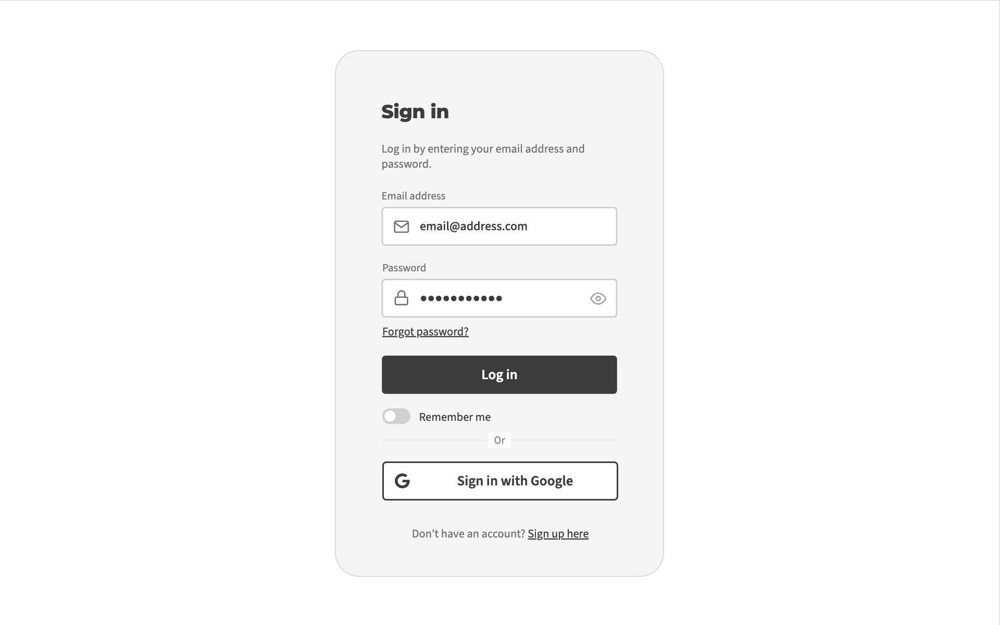
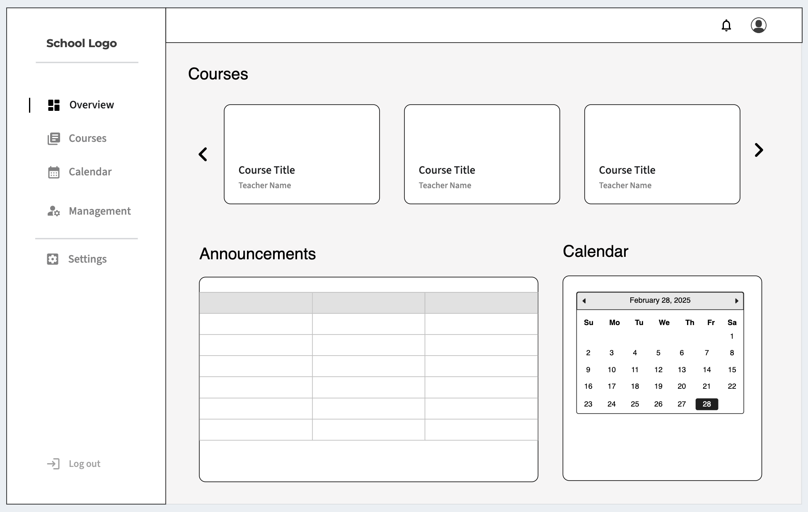
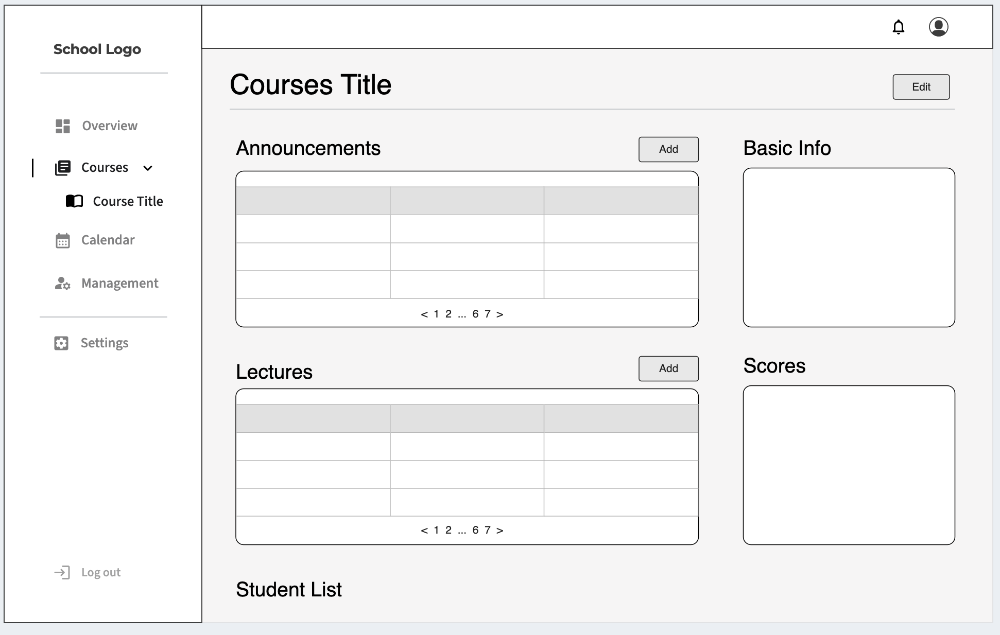

# Project Plan: E-Learning System

## Project Overview
The goal of this project is to develop a web-based E-Learning system that enables teachers to manage and record students' learning progress, assignments, scores, and attendance. This platform will provide an intuitive interface for teachers, students, and administrators to streamline learning tracking and class management.

## Key Features
- **User Management**: Role-based access for teachers, students, and administrators.
- **Course & Class Management**: Create and manage courses, enroll students, and assign teachers.
- **Attendance Tracking**: Mark and review student attendance.
- **Assignments**: Create assignment contents by edit texts or uploading pdf files.
- **Grading**: Record students' assignment and exam grades.
- **Announcements & Notifications**: Email and in-app notifications for course announcements and important dates (e.g. assignment deadline, exam dates) reminders.
- **Reporting & Analytics**: Generate reports on student performance and engagement.

## Technology Stack
- **Frontend**: React.js, Bootstrap
- **Backend**: .NET Core (C#)
- **Database**: SQL Server
- **Authentication**: ASP.NET Core Identity
- **Hosting**: Azure / AWS / Firebase (TBD)
- **Version Control**: GitHub
- **Communication**: WebSockets for real-time notifications

## Project Timeline
| Phase | Task | Duration | Expected Completion |
|-------|------|----------|---------------------|
| Phase 1 | API & Data Model Design | 2 weeks | MM/DD/YYYY |
| Phase 2 | UI/UX Design | 1 weeks | MM/DD/YYYY |
| Phase 3 | Backend & Database Development | 3 weeks | MM/DD/YYYY |
| Phase 4 | Frontend Development | 3 weeks | MM/DD/YYYY |
| Phase 5 | Testing & QA | 1 weeks | MM/DD/YYYY |
| Phase 6 | Deployment & Release | 1 weeks | MM/DD/YYYY |

## User Story

**Admin**
- [ ] As an admin, I want to create, update, and delete courses
- [ ] As an admin, I want to create and manage teacher / student accounts
- [ ] As an admin, I want to update student list for a course by uploading csv files
- [ ] As an admin, I want to send invitation eamils to new users so they can set up their accounts

**Teacher**
- [ ] As a teacher, I want to access the courses I teach
- [ ] As a teacher, I want to edit course info
- [ ] As a teacher, I want to add course announcements and set up important dates (e.g, assignment due date, exam date)
- [ ] As a teacher, I want to record student attendance for each lesson session
- [ ] As a teacher, I want to add notes and upload materials for each lesson session
- [ ] As a teacher, I want to create assignments and upload materials
- [ ] As a teacher, I want to record students' assignment and exam grades
- [ ] As a teacher, I want to see student list, make notes, and see their performance
- [ ] As a teacher, I want to generate final course grades and print course report

**Student**
- [ ] As a student, I want to access the courses I take
- [ ] As a student, I want to see announcements and the important dates of the course
- [ ] As a student, I want to see the materials for each lesson session
- [ ] As a student, I want to see the assignments and upload my assignment
- [ ] As a student, I want to see my performance, e.g. attendance and grades
- [ ] As a student, I want to see my classmates list

**General**
- [ ] As a user, I want to login with email/passwd or through Google account
- [ ] As a user, I want to upload avatar images and edit my info page
- [ ] As a user, I want to be notified when there are any updates with my course or account

## UI/UX (Screen Mocks)

**Mockup - Sign In**

**Mockup - Dashboard**

**Mockup - Course Page**

- Use the Boostrap template: [KaiAdmin](https://themekita.com/demo-kaiadmin-lite-bootstrap-dashboard/livepreview/demo1/)

## Data Model

- User
- Course
- Session
- CourseContent
  - type: material, assignment, exam
- CourseEvent: announcements or scheduled events

## API Design

TBD

   
> [!TIP]
> The project sound good, it should cover all the aspects of the .NET course.

 

> [!CAUTION]
> I recommend implementing login/logout/registration functionality.

> [!CAUTION]
> I recommend adding the screen mocks here to guide yourself.
