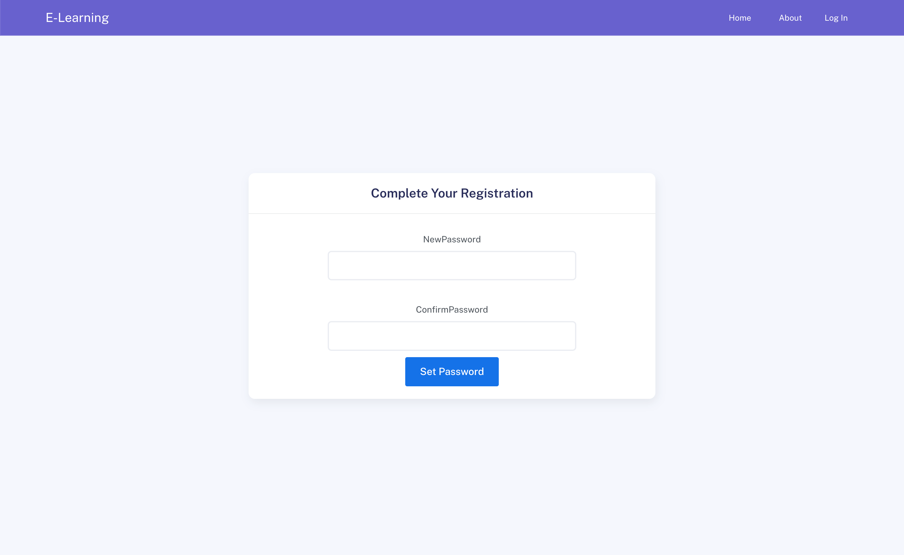
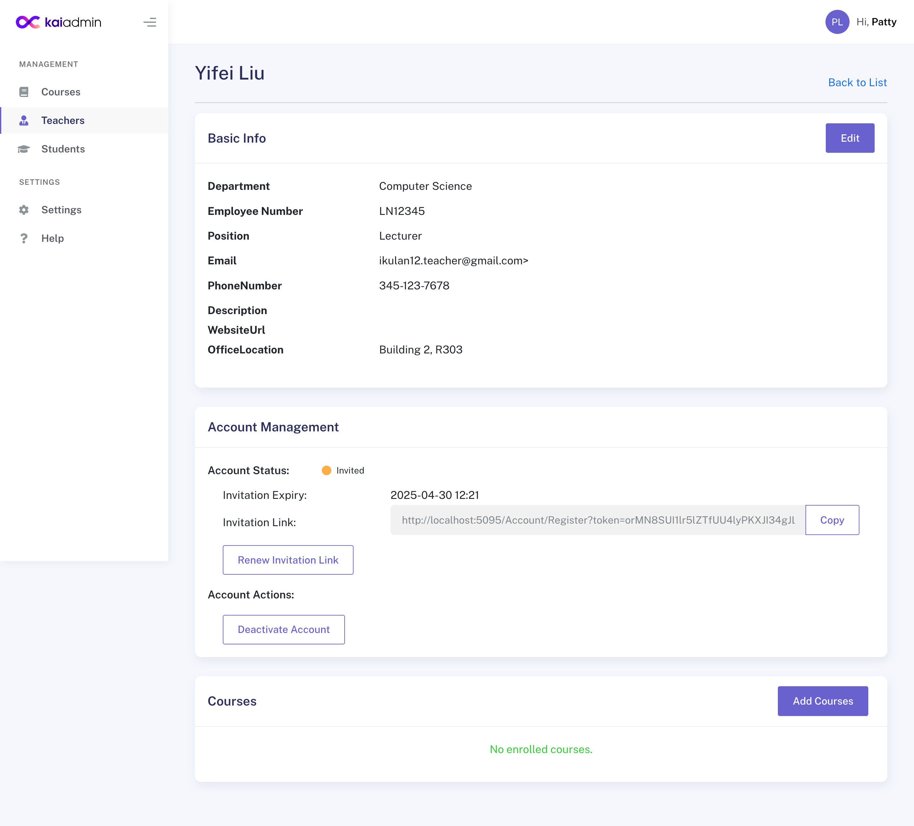
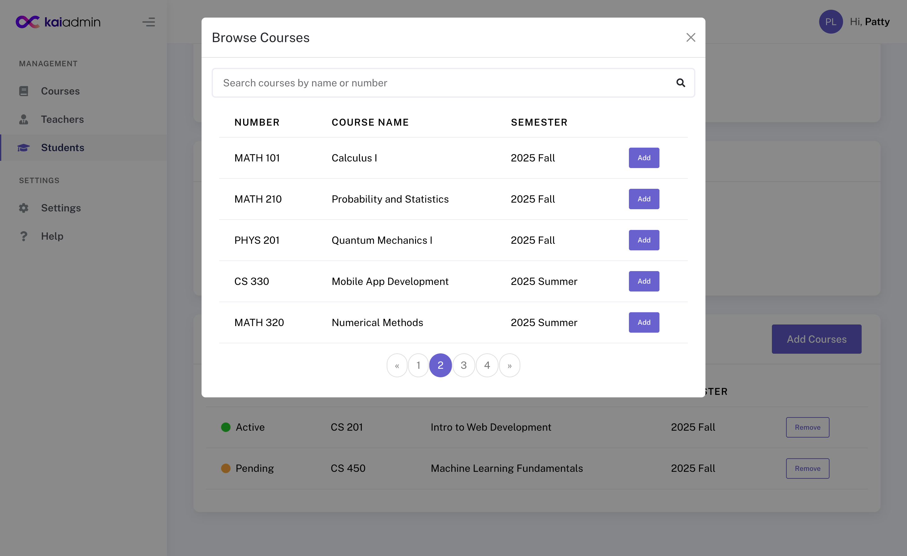
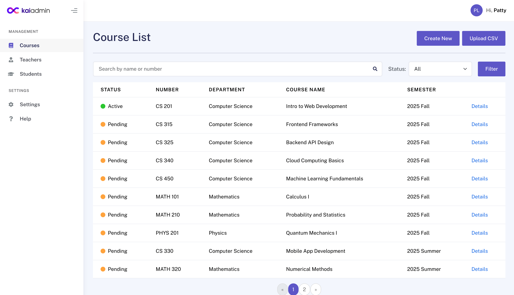
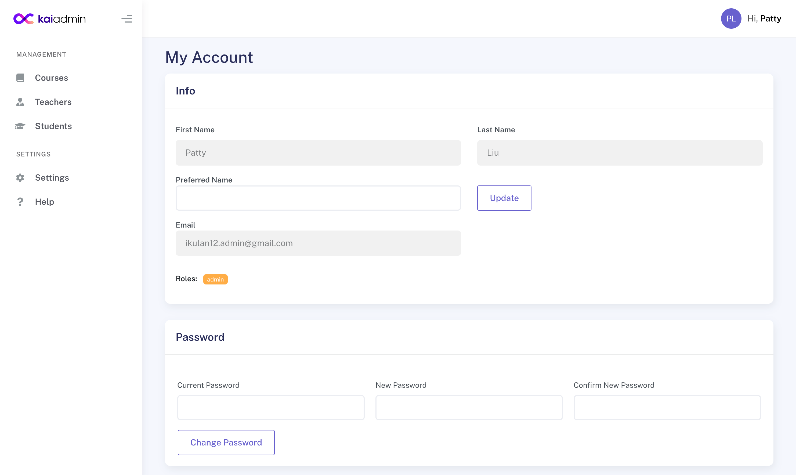

# E-Learning System

## Project Overview

The goal of this project is to develop a web-based E-Learning system that enables teachers to manage and record students' learning progress, assignments, scores, and attendance. This platform will provide an intuitive interface for teachers, students, and administrators to streamline learning tracking and class management.

[Project Plan](Docs/project_plan.md)

**Special Thanks**

This project was developed as the final assignment for the [ComIT .NET Core Course](https://certificates.comit.org/a0768a2c-60a4-4263-95c3-6b9b868c5503#acc.7390mPbp).
Special thanks to the ComIT team and instructors for their support and guidance.

## Technology Stack

- **Frontend**: HTML, CSS, Bootstrap (Template: [Kaiadmin](https://themekita.com/kaiadmin-lite-bootstrap-5-dashboard.html)), JavaScript
- **Backend**: ASP.NET Core MVC (C#, .NET 8.0)
- **Database**: SQL Server
- **Authentication & Authorization**: ASP.NET Core Identity
- **Hosting**: Azure

## Key Learnings

**Authentication & Authorization**

- Integrated ASP.NET Core Identity for user authentication and role management
- Implemented invitation-based registration
- Role-based access control for teachers, students, and administrators
- Features include login, logout, invitation link regeneration, and password change

**Database**

- Used Entity Framework Core to work with relational data models, including many-to-many relationships
- Managed schema changes through EF Core data migrations
- Implemented data searching, filtering, and pagination

**Full Stack Development**

- Built with the ASP.NET Core MVC framework
- Utilized Razor syntax, tag helpers, and data annotations
- Applied Bootstrap and a template for UI styling
- Added JavaScript for interactive and dynamic front-end behavior

## Screenshots

1. Invitation-based Registration
   

2. Admin - User Account Management
   

3. Admin - Enroll Course Modal
   

4. Admin - Course Management
   

5. Account Settings Page
   
